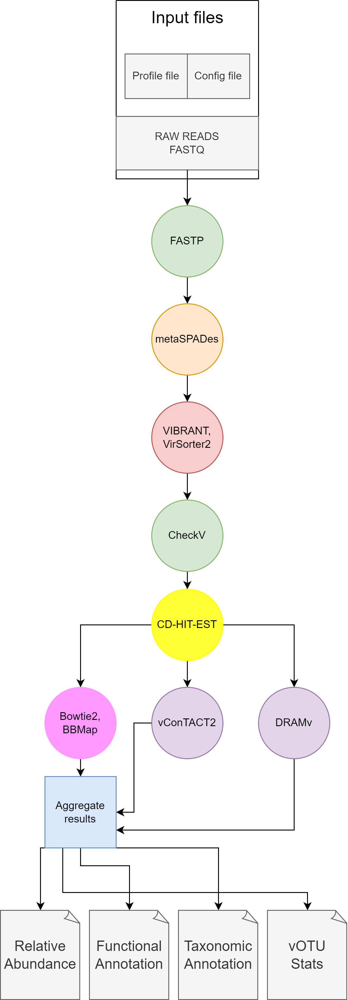

# VirMake: a Snakemake pipeline for viral metagenomic data analysis

## Contents

1. [About VirMake](#about-virmake)
2. [Installation](#installation)
3. [Usage](#usage)
4. [Output explained](#output-explained)
5. [Citations](#citations)

## About VirMake

VirMake is a Snakemake based pipeline that offers viral metagenic data analysis on paired-end data. It offers taxonomic and functional annotation, supports offline running and support for HPC cluster execution. It is made for Linux based systems and has been tested on SLURM cluster execution.

<!--  -->

## Installation

### Prerequisites:
- Git
- Conda (Miniconda or Anaconda)
- At least 125 GB of RAM and 180 GB of free disk space. *Additional disk
space **will be needed** for the output files depending on the size and number of your samples!*

### To install VirMake follow these steps:

1. Clone the repository using `git clone https://github.com/uio-bmi/VirMake.git`
2. Run VirMake setup script `python setup.py -y`. The `-y` flag will automatically trigger
   installation of all necessary dependencies. If you want to install the dependencies yourself, you can omit the flag. Also, **if you encounter any errors** during the installation, please run the setup script again without the flag. We recommend using `screen` to run the setup script. Visit
   [this link](https://linuxize.com/post/how-to-use-linux-screen/) for more information on how to use `screen`.
3. Sit back and relax... The installation will take a while.
4. Check `setup.log` file for any errors. If there are no errors, you are ready to go!

An expected directory structure should look like this (files are omitted for readability):

```
VirMake
├── databases
│   ├── checkv
│   ├── DRAM
│   ├── INPHARED
│   ├── RefSeq
│   ├── vcontact2
│   ├── vibrant
│   └── virsorter2
├── envs
├── examples
├── utils
├── workflow
│   ├── .snakemake
│   └── scripts
└── working_dir
    └── input
```

## Usage

**Before you do anything, make sure that `virmake` conda environment that was created during the installation is activated. You can do this by running:**

```
conda activate virmake
```

**Also make sure to run all commands from the root directory of the repository.**

Please note that `virmake` has inbuilt help that can be accessed by running:

```
./virmake -h
```

### Environments preparation

VirMake uses conda environments to run separate rules. These environments will be set up
on the first run and will be stored in `VirMake/workflow/.snakemake/` folder for subsequent
runs. This takes a substantial amount of time on the first run. If you want to set up the
environments before running the workflow use:

```
./virmake prep
```

After that you can run the workflow offline.

### Getting samples

To run the workflow you will need to provide
input files. The input files should be placed in `VirMake/working_dir/input/` folder. These
need to be in `.fastq.gz` format. The input files should be named in the following format:
`<sample_name>_1.fastq.gz` and `<sample_name>_2.fastq.gz` (VirMake only works for paired-end reads).
You can also download samples from SRA database by using:

```
./virmake get SRA <accession_number>
```

This command will download the samples from SRA database, place them in `VirMake/working_dir/input/` folder, `gzip` them and rename them accordingly.

You can get example files from [1] by running:

```
./virmake get SRA PRJNA524703
```

[1] Liang, G., Zhao, C., Zhang, H. et al. The stepwise assembly of the neonatal virome is modulated by breastfeeding. Nature 581, 470–474 (2020). [https://doi.org/10.1038/s41586-020-2192-1](https://doi.org/10.1038/s41586-020-2192-1)

### Running the workflow

To run the workflow use:

```
./virmake run
```

To run the workflow with more personalized options please use `./virmake run -h` and read the help page.

### Inspecting results

If you are working on a remote server do not forget to **log in with port tunneling enabled**.
To do this run:

```
ssh -R 8080:localhost:8080 username@server_address
```

Once the workflow is finished you can inspect the results by running:

```
./virmake inspect
```

and click on the link that will be provided in the terminal.
The link should look like `http://127.0.0.1:8080`.
This will launch shiny app within your browser.
To exit the shiny app press `CTRL + C` in the terminal.

### Workflow config file

To adjust the workflow settings edit the `config.yaml` file. The file is located in `VirMake/workflow/config.yaml`.
The file contains the following adjustable settings (default values are provided in square brackets):

```
assembler: [metaSpades]                     # assembler being used
                                            # currently only metaSpades is supported
cd-hit-est:
    coverage: [0.85]                        # coverage threshold for cd-hit-est
    identity_threshold: [0.95]              # identity threshold for cd-hit-est
job_type:
    big: [bigmem]
    normal: [normal]
    small: [normal]
memory:                                     # memory requirements for each job type in megabytes
    big: [32000]
    metaquast: [63000]
    normal: [16000]
    small: [8000]
    tiny: [1000]
    vcontact2: [63000]
min_contig_size: [1000]                     # minimum contig size for DRAMv annotate
min_coverage: [75]                          # minimum coverage for combine_coverage.R script

###############################################################################################

# absolute paths to various folders being used by the pipeline
# we do not recommend changing these unless you know what you are doing!
path:
    benchmark: [/.../VirMake/working_dir/benchmark]
    database:
        DRAM: [/.../VirMake/databases/DRAM]
        INPHARED: [/.../VirMake/databases/INPHARED]
        RefSeq: [/.../VirMake/databases/RefSeq]
        checkv: [/.../VirMake/databases/checkv]
        vcontact2: [/.../VirMake/databases/vcontact2]
        vibrant: [/.../VirMake/databases/vibrant]
        virsorter2: [/.../VirMake/databases/virsorter2]
    envs: [/.../VirMake/envs]
    input: [/.../VirMake/working_dir/input]
    log: [/.../VirMake/working_dir/log]
    output: [/.../VirMake/working_dir/output]
    profile: []
    scripts: [/.../VirMake/workflow/scripts]
    temp: [/.../VirMake/working_dir/temp]
    virmake: [/.../VirMake]

###############################################################################################

quality_threshold: [medium]                 # quality threshold for fastp
threads: [24]                               # minimum number of threads to use for parallelized jobs
time:                                       # time requirements for each job type
    big: [13 h]
    metaquast: [24 h]
    normal: [6 h]
    small: [1 h]
    tiny: [30 min]
    vcontact2: [24 h]
trim_percentage: [0.95]
vibrant:
    is_virome: ['no']                       # is the sample a virome? ('yes' or 'no')
virsorter2:
    pass1:
        min_lenght: [3000]                  # minimum contig length for virsorter2_pass1
                                            # contigs with length < 3000 will be discarded

        min_score: [0.5]                    # minimum quality score for virsorter2_pass1

        # viral groups searched for by virsorter2_pass1
        viral_groups: [dsDNAphage,ssDNA,NCLDV,RNA,lavidaviridae]
    pass2:
        min_lenght: [1000]
        min_score: [0.5]
        viral_groups: [dsDNAphage,ssDNA,NCLDV,RNA,lavidaviridae]
```

### HPC profile file

You can adjust the HPC profile file to suit your needs. To do this create a new profile file and
copy its absolute path to config.yaml under `path:profile:` key. This key is empty by default.

The profile file should look like this:

```
---
reason: True
show-failed-logs: True
keep-going: True
printshellcmds: True

# Cluster submission

# Provide a custom name for the jobscript that is submitted to the cluster
jobname: "{rule}.{jobid}"

# Maximal number of cluster/drmaa jobs per second, fractions allowed
max-jobs-per-second: 20

# Maximal number of job status checks per second
max-status-checks-per-second: 10

cluster: "sbatch -A [INSTER_ACCOUNT] --output=slurm_out/slurm-%j.out -J {rule}_{wildcards} --mem={resources.mem_mb} --time={resources.runtime} --cpus-per-task={threads} --partition={resources.partition}"
default-resources:
  - mem_mb=4000
  - runtime="0-00:30:00"
  - partition=normal
```

## Output explained

The pipeline provides many files and to help navigate these this section will explain what each section provides.
These are all folders within the `VirMake/working_dir/output` folder.

### cdhit/

The folder contains the cluster file produced by cdhit and the dereplicated file.

### checkv/

This folder contains all the checkV resulst grouped by what they were run on, and which sample it is. This includes `vibrant`, `virsorter2` (pass 1 and 2). The interesting files here are the `quality_summary.tsv` which is the summarized result of checkv for that run.


### combined_all/, combined_vibrant/ and combined_virsorter2/

These folders contain the combined `.fasta` files from all paired-end samples.

### contig_stats/

This folder contains the pileup.sh results and coverage statistics. An intersting file that is used in the aggregation is the `trimmed_mean_coverage.tsv`, which is used when generating the relative abundance file for statistics folder.

### DRAMv/

This folder contains the results from DRAMv, both annotate and distill. The most relevant files can be found within the `distilled` folder. The `amg_summary.tsv` contains all the AMG and functional annotation information. The `product.html` file is a heatmap of all AMGs, where they exist, their function and how many there are within the vOTU.

### fastp/

This folder contains the fastp reports on all samples. The most relevant file here is the `<sample_name>.html` which gives an overview of the quality statistics of each sample. This
folder also contains preprocessed `.fastq` files that are later used in the pipeline.

### fastqc_raw/ and fastqc_qc/

These folders contain the FastQC results on both the RAW reads and the quality controlled reads respectively. The provided html files for each sequence gives an overview of the quality statistics of each sample.

### filtered_vibrant/ and filtered_virsorter2/
These folders contains two files with only quality controlled contig names within `filtered_contigs` and their fasta sequence in `filtered_combined.fna`

### graphanalyzer/

This folder contains all graphanalyzer results. Most relevant is the folder `single-views_vOTU_results` which contain an interactive plot of the clusters for each vOTU. Another important file is the `results_vcontact2_vOTU_results.csv` which contains the proccessed Vcontact2 output and contains all relevant taxonomic clasification information.

### mapping/

Contains all the index and sam files from bowtie2 building and maping. The `.sam` files can be used for further analysis if the users want it.

### metaQUAST/

This folder contains the quality controlled reports from all assembled contigs within each sample. The `summary` folder contains summaries of all quality control processes and the `combined_reference` folder contains results pertaining to comparisons towards the reference database of RefSeq Viral.


### metaSpades/

This folder contains all assembled contigs ordered by sample. The most relevant file here is the assembled contig file `contigs.fasta`

### prodigal/

This folder contains the results from running prodigal and provides the predicted genes and proteins. The pipeline uses a simplified format of these with the file `ORFs.genes.simple.faa`.

### statistics/

This folder contains the aggregated statistics and plots for the pipeline.
The Taxonomic annotation information can be found in the three files:
`vOTU_stats_combined.tsv` `vOTU_stats_vibrant.tsv` `vOTU_stats_virsorter2.tsv`. They give insight of the taxonomic classification at Family, Subfamily and Genus level. it also includes the checkv quality score, accession number and if the identified virus is a provirus.

The functional annotation can be found in the file `vOTU_AMGs.tsv`. It provides the protein/gene, origin scaffold, ID and the fucntional description.

Some interesting files for seeing the state of all samples at different stages can be found in: `Sample_stats_vibrant.tsv`, `Sample_stats_virsorter2.tsv` and `Combined_Sample_stats.tsv`.

The file `vOTU_mapped_to_reads.tsv` contains the vOTUs mapped back to their original sequences and if they are lytic or not.

### vcontact2/

This folder contains the VCONTACT2 output. The folder `genes_2_genomes` contains the files used when introducing the INPHARED database to be included in the taxonomic annotation. For further analysis the `c1.clusters` and `c1.ntw` can be used and viewed within [Cytoscape](https://cytoscape.org/).

### vibrant_pass1/ and vibrant_pass2/

These folders contain all VIBRANT results grouped by sample and one for the vOTUs respectively. It can be a bit tricky to navigate these but they contain a lot of interesting files. The folder `VIBRANT_results` contains the several tables produced by VIBRANT. The direct viral sequences used by the pipeline is gathered from the folder `VIBRANT_phages/VIBRANT_contigs/contigs.phages_combined.fna` and `VIBRANT_vOTU_derep95_combined/VIBRANT_phages_vOTU_derep95_combined/vOTU_derep95_combined.phages_combined.fna`. The relevant taxonomic information can be found within `VIBRANT_results_contigs/VIBRANT_genome_quality_contigs.tsv` and the different AMG_ files within `VIBRANT_results`

### virsorter2_pass1/ and virsorter2_pass2/

These folders contain all results from virsorter2 (pass 1 and 2 respectively). The most relevant file here is the `final-viral-score.tsv` file, which contains the scorings for each contig and what type of virus it was deemed as.

### vOTU

This folder contains dereplicated combined `.fasta` file in which all headers were renamed to subsequent vOTUs.
